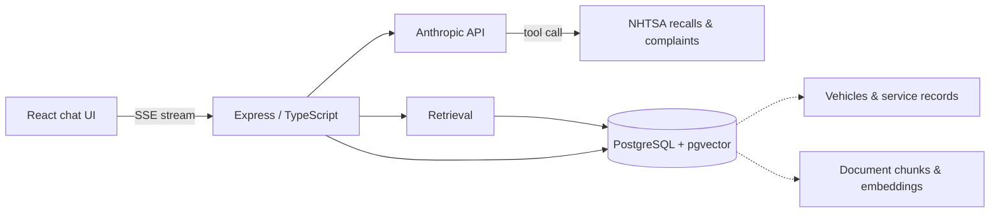

# Garage Copilot

A repair assistant for people who fix their own cars. Describe a symptom, get an answer grounded in real documentation with citations you can check — plus recall and complaint history for your specific vehicle, and a service log that the assistant can actually reason about.

> **Status: in active development.** Week 1 of 4. The backend skeleton and health check are working; retrieval, tool-calling, and the UI are in progress. See [Roadmap](#roadmap).

---

## Why this exists

Most repair advice online is either paywalled behind factory service manuals or scattered across forum threads of varying reliability. Meanwhile the genuinely authoritative free source — NHTSA's recall and complaint database — is almost unusable through its own interface.

I rebuilt an engine in a driveway and later did suspension and drive-unit work on an EV. Both times the hard part wasn't turning wrenches, it was finding trustworthy information and knowing whether anyone else had hit the same failure. This is the assistant I wanted then.

## What it does

**Ask a question in plain language.** "Clunk from the front left over bumps, 2019 Model 3" returns an answer assembled from retrieved documentation, with every claim linked to its source.

**Grounded in a real corpus.** Answers come from retrieved documents, not model recall. If the corpus doesn't cover it, the assistant says so rather than inventing a torque spec.

**Live vehicle data via tool-calling.** The model can query NHTSA's recall and complaint APIs mid-conversation for the exact year, make, and model being discussed — so "has anyone else had this?" gets a real answer from official data.

**My Garage.** Vehicles and service records as a proper relational model. Once the assistant knows what you own and what you've done to it, questions like "what maintenance am I overdue for?" become answerable.

## Architecture



Ingestion runs offline: documents are chunked, embedded, and written to `pgvector`. At query time the API embeds the question, retrieves the nearest chunks, and passes them to the model as context along with the tool definitions. Responses stream back over SSE.

## Tech stack

| Layer | Choice | Why |
|---|---|---|
| API | TypeScript, Express | Type safety across the whole stack |
| Database | PostgreSQL 17 + pgvector | Relational data and vector search in one system — no separate vector DB to operate |
| LLM | Anthropic API | Streaming and tool-calling |
| Frontend | React | Streaming chat interface |
| Infra | Docker Compose | One command to a working environment |
| CI | GitHub Actions | Typecheck and test on every push |

Postgres with `pgvector` was a deliberate choice over a dedicated vector database. At this corpus size the retrieval quality is equivalent, and keeping vectors alongside the relational data means a single backup story, a single connection pool, and joins between embeddings and vehicle records without a network hop.

## Data sources and licensing

Corpus selection was constrained by licensing, not just usefulness. Forum archives would be the richest source of real-world repair knowledge and are also other people's copyrighted writing, published under terms that prohibit scraping. They are deliberately excluded.

What's included:

- **[NHTSA recalls and complaints API](https://www.nhtsa.gov/nhtsa-datasets-and-apis)** — US government work, public domain. Queried live via tool-calling rather than bulk-ingested.
- **[Motor Vehicle Maintenance & Repair Stack Exchange](https://mechanics.stackexchange.com/)** — Creative Commons licensed, attributed to the original author with a link back.
- **First-party repair notes** — my own documented work, written up as structured cases.

Where a question would be best answered by a forum thread, the assistant searches and links out to it rather than reproducing the content.

## Getting started

**Requirements:** Node 24+, Docker, an Anthropic API key.

```bash
git clone git@github.com:anvarov/garage-copilot.git
cd garage-copilot
npm install

cp .env.example .env        # add your ANTHROPIC_API_KEY

docker compose up -d        # Postgres + pgvector
npm run dev
```

Verify:

```bash
curl localhost:3000/health
# {"ok":true}
```

### Environment

| Variable | Description |
|---|---|
| `ANTHROPIC_API_KEY` | Anthropic API key |
| `DATABASE_URL` | Postgres connection string |
| `PORT` | API port (default `3000`) |

## Roadmap

- [x] Backend skeleton, health check, Docker Compose
- [ ] Postgres connection, schema, migrations
- [ ] Streaming chat endpoint
- [ ] Document ingestion → chunking → embeddings → pgvector
- [ ] Retrieval with citations
- [ ] NHTSA tool-calling
- [ ] React chat UI
- [ ] My Garage: vehicles and service records
- [ ] Tests and CI
- [ ] Deployment

## Disclaimer

Not affiliated with, endorsed by, or connected to any vehicle manufacturer. Output is informational and can be wrong. Verify anything safety-critical against a factory service manual and torque spec before you turn a wrench.

## License

MIT
